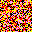

sanneal
=======

An implementation of the `simulated annealing <http://en.wikipedia.org/wiki/Simulated_annealing>`_
optimization algorithm.

Installation
------------

To run demos without installing::

    $ cd sanneal
    $ python3 -m sanneal.sanneal_demo

To install::

    $ cd sanneal
    $ easy_install .

Demos
-----

(incomplete)

Random pixels:

After "annealing":

